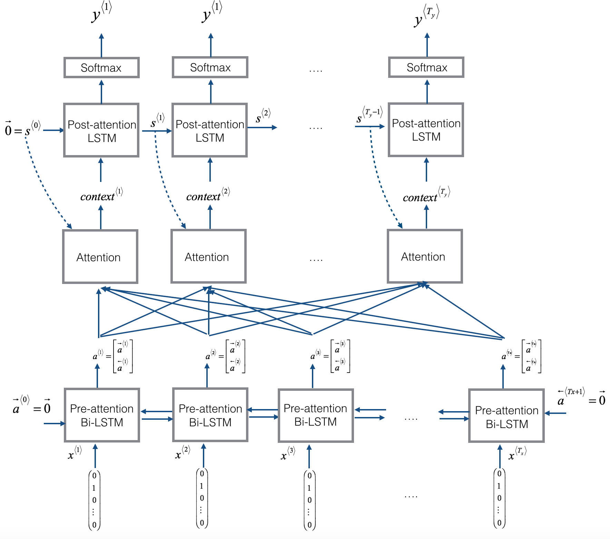

# Introduction to Neural Networks

This repository contains Jupyter notebooks for the assignments and projects completed as part of a sequential learning course on the topic. The course covers the foundations of sequential learning, including topics such as recurrent neural networks, long short-term memory networks, and other related topics


## Course Description
In this course, we will start with an introduction to sequential learning and explore how to build recurrent neural networks (RNNs) to perform tasks such as sentiment analysis, machine translation, and text generation. We will also learn about long short-term memory networks (LSTMs) and other related architectures that can be used for tasks such as speech recognition, text summarization, sentiment analysis and for other tasks


## Notebook list
- **RNN**:Implementing key components of a Recurrent Neural Network, or RNN, in NumPy! 
- **Dinosaurus_Island**: A character-level language model to generate new names
- **Word2Vec**: Loading, measuring similarity between, and modifying pre-trained embeddings
- **Emoji_Classifier**: Used word vector representations to build an Emojifier.
- **Neural_machine_translation_with_attention**:  Neural Machine Translation (NMT) model to translate human-readable dates into machine-readable dates
- **Jazz**: Implemented a model that uses an LSTM to generate music.
- **Trigger_Word_Detection**: Constructed a speech dataset and implement an algorithm for trigger word detection (sometimes also called keyword detection, or wake word detection).

## Requirements
- Jupyter Notebook
- Python 3
- Tensorflow 2
- Numpy, Matplotlib, Pandas

## Usage
1. Clone the repository

```
git clone https://github.com/paligonshik/SEQUENCIAL_LEARNING.git
```
2. Install the required packages

``` 
pip install -r requirements.txt
```
3. Jupyter Notebook
```
jupyter notebook
```

# [Dinosaurus_Island](Dinosaurus_Island)
In this repo,

By the end of this notebook, you'll be able to: 


* Store text data for processing using an RNN 
* Build a character-level text generation model using an RNN
* Sample novel sequences in an RNN
* Explain the vanishing/exploding gradient problem in RNNs
* Apply gradient clipping as a solution for exploding gradients

- Initialize parameters 
- Run the optimization loop
    - Forward propagation to compute the loss function
    - Backward propagation to compute the gradients with respect to the loss function
    - Clip the gradients to avoid exploding gradients
    - Using the gradients, update your parameters with the gradient descent update rule.
- Return the learned parameters 
    

<caption><center><font><b>Figure 1</b>: Recurrent Neural Network, similar to what you built in the previous notebook "Building a Recurrent Neural Network - Step by Step."  </center></caption>

* At each time-step, the RNN tries to predict what the next character is, given the previous characters. 
* $\mathbf{X} = (x^{\langle 1 \rangle}, x^{\langle 2 \rangle}, ..., x^{\langle T_x \rangle})$ is a list of characters from the training set.
* $\mathbf{Y} = (y^{\langle 1 \rangle}, y^{\langle 2 \rangle}, ..., y^{\langle T_x \rangle})$ is the same list of characters but shifted one character forward. 
* At every time-step $t$, $y^{\langle t \rangle} = x^{\langle t+1 \rangle}$.  The prediction at time $t$ is the same as the input at time $t + 1$.


<a name='2-1'></a>
### 2.1 - Clipping the Gradients in the Optimization Loop

In this section you will implement the `clip` function that you will call inside of your optimization loop. 

#### Exploding gradients
* When gradients are very large, they're called "exploding gradients."  
* Exploding gradients make the training process more difficult, because the updates may be so large that they "overshoot" the optimal values during back propagation.

Recall that your overall loop structure usually consists of:
* forward pass, 
* cost computation, 
* backward pass, 
* parameter update. 

Before updating the parameters, you will perform gradient clipping to make sure that your gradients are not "exploding."

#### Gradient clipping
In the exercise below, you will implement a function `clip` that takes in a dictionary of gradients and returns a clipped version of gradients, if needed. 

* There are different ways to clip gradients.
* You will use a simple element-wise clipping procedure, in which every element of the gradient vector is clipped to fall between some range [-N, N]. 
* For example, if the N=10
    - The range is [-10, 10]
    - If any component of the gradient vector is greater than 10, it is set to 10.
    - If any component of the gradient vector is less than -10, it is set to -10. 
    - If any components are between -10 and 10, they keep their original values.


<caption><center><font><b>Figure 2</b>: Visualization of gradient descent with and without gradient clipping, in a case where the network is running into "exploding gradient" problems. </center></caption>


<a name='2-2'></a>
### 2.2 - Sampling

Now, assume that your model is trained, and you would like to generate new text (characters). The process of generation is explained in the picture below:


<caption><center><font><b>Figure 3</b>: In this picture, you can assume the model is already trained. You pass in $x^{\langle 1\rangle} = \vec{0}$ at the first time-step, and have the network sample one character at a time. </center></caption>


- **Step 2**: Run one step of forward propagation to get $a^{\langle 1 \rangle}$ and $\hat{y}^{\langle 1 \rangle}$. Here are the equations:

*hidden state:*  
$$ a^{\langle t+1 \rangle} = \tanh(W_{ax}  x^{\langle t+1 \rangle } + W_{aa} a^{\langle t \rangle } + b)\tag{1}$$

*activation:*
$$ z^{\langle t + 1 \rangle } = W_{ya}  a^{\langle t + 1 \rangle } + b_y \tag{2}$$

*prediction:*
$$ \hat{y}^{\langle t+1 \rangle } = softmax(z^{\langle t + 1 \rangle })\tag{3}$$

- Details about $\hat{y}^{\langle t+1 \rangle }$:
   - Note that $\hat{y}^{\langle t+1 \rangle }$ is a (softmax) probability vector (its entries are between 0 and 1 and sum to 1). 
   - $\hat{y}^{\langle t+1 \rangle}_i$ represents the probability that the character indexed by "i" is the next character.  
   - A `softmax()` function is provided for you to use.


# [Word2Vec](Word2Vec)


In this repo,

By the end of this assignment, you'll be able to:

* Define notation for building sequence models
* Describe the architecture of a basic RNN
* Identify the main components of an LSTM
* Implement backpropagation through time for a basic RNN and an LSTM
* Give examples of several types of RNN 

- Initialize parameters 
- Run the optimization loop
    - Forward propagation to compute the loss function
    - Backward propagation to compute the gradients with respect to the loss function
    - Clip the gradients to avoid exploding gradients
    - Using the gradients, update your parameters with the gradient descent update rule.
- Return the learned parameters 


<a name='1-1'></a>
### 1.1 - RNN Cell

You can think of the recurrent neural network as the repeated use of a single cell. First, you'll implement the computations for a single time step. The following figure describes the operations for a single time step of an RNN cell: 


<caption><center><font'><b>Figure 2</b>: Basic RNN cell. Takes as input $x^{\langle t \rangle}$ (current input) and $a^{\langle t - 1\rangle}$ (previous hidden state containing information from the past), and outputs $a^{\langle t \rangle}$ which is given to the next RNN cell and also used to predict $\hat{y}^{\langle t \rangle}$ 
</center></caption>

**`RNN cell` versus `RNN_cell_forward`**:
* Note that an RNN cell outputs the hidden state $a^{\langle t \rangle}$.  
    * `RNN cell` is shown in the figure as the inner box with solid lines  
* The function that you'll implement, `rnn_cell_forward`, also calculates the prediction $\hat{y}^{\langle t \rangle}$
    * `RNN_cell_forward` is shown in the figure as the outer box with dashed lines


<a name='1-2'></a>
### 1.2 - RNN Forward Pass 

- A recurrent neural network (RNN) is a repetition of the RNN cell that you've just built. 
    - If your input sequence of data is 10 time steps long, then you will re-use the RNN cell 10 times 
- Each cell takes two inputs at each time step:
    - $a^{\langle t-1 \rangle}$: The hidden state from the previous cell
    - $x^{\langle t \rangle}$: The current time step's input data
- It has two outputs at each time step:
    - A hidden state ($a^{\langle t \rangle}$)
    - A prediction ($y^{\langle t \rangle}$)
- The weights and biases $(W_{aa}, b_{a}, W_{ax}, b_{x})$ are re-used each time step 
    - They are maintained between calls to `rnn_cell_forward` in the 'parameters' dictionary


<caption><center><b>Figure 3</b>: Basic RNN. The input sequence 

$x = (x^{\langle 1 \rangle}, x^{\langle 2 \rangle}, ..., x^{\langle T_x \rangle})$  is carried over $T_x$ time steps. The network outputs $y = (y^{\langle 1 \rangle}, y^{\langle 2 \rangle}, ..., y^{\langle T_x \rangle})$. </center></caption>


# [Word2Vec](Word2Vec)


In this repo,

**After this assignment you'll be able to**:

* Explain how word embeddings capture relationships between words
* Load pre-trained word vectors
* Measure similarity between word vectors using cosine similarity
* Use word embeddings to solve word analogy problems such as Man is to Woman as King is to ______.  

- Initialize parameters 
- Run the optimization loop
    - Forward propagation to compute the loss function
    - Backward propagation to compute the gradients with respect to the loss function
    - Clip the gradients to avoid exploding gradients
    - Using the gradients, update your parameters with the gradient descent update rule.
- Return the learned parameters 


<a name='3'></a>
## 3 - Cosine Similarity

To measure the similarity between two words, you need a way to measure the degree of similarity between two embedding vectors for the two words. Given two vectors $u$ and $v$, cosine similarity is defined as follows: 

$$\text{CosineSimilarity(u, v)} = \frac {u \cdot v} {||u||_2 ||v||_2} = cos(\theta) \tag{1}$$

* $u \cdot v$ is the dot product (or inner product) of two vectors
* $||u||_2$ is the norm (or length) of the vector $u$
* $\theta$ is the angle between $u$ and $v$. 
* The cosine similarity depends on the angle between $u$ and $v$. 
    * If $u$ and $v$ are very similar, their cosine similarity will be close to 1.
    * If they are dissimilar, the cosine similarity will take a smaller value. 


<caption><center><font color='purple'><b>Figure 1</b>: The cosine of the angle between two vectors is a measure of their similarity.</font></center></caption>

<a name='ex-1'></a>
### Exercise 1 - cosine_similarity

Implement the function `cosine_similarity()` to evaluate the similarity between word vectors.

**Reminder**: The norm of $u$ is defined as $ ||u||_2 = \sqrt{\sum_{i=1}^{n} u_i^2}$

#### Additional Hints
* You may find [np.dot](https://numpy.org/doc/stable/reference/generated/numpy.dot.html), [np.sum](https://numpy.org/doc/stable/reference/generated/numpy.sum.html), or [np.sqrt](https://numpy.org/doc/stable/reference/generated/numpy.sqrt.html) useful depending upon the implementation that you choose.


Do you notice anything surprising? It is astonishing how these results reflect certain unhealthy gender stereotypes. For example, we see “computer” is negative and is closer in value to male first names, while “literature” is positive and is closer to female first names. Ouch! 

You'll see below how to reduce the bias of these vectors, using an algorithm due to [Boliukbasi et al., 2016](https://arxiv.org/abs/1607.06520). Note that some word pairs such as "actor"/"actress" or "grandmother"/"grandfather" should remain gender-specific, while other words such as "receptionist" or "technology" should be neutralized, i.e. not be gender-related. You'll have to treat these two types of words differently when debiasing.

<a name='5-1'></a>
### 5.1 - Neutralize Bias for Non-Gender Specific Words 

The figure below should help you visualize what neutralizing does. If you're using a 50-dimensional word embedding, the 50 dimensional space can be split into two parts: The bias-direction $g$, and the remaining 49 dimensions, which is called $g_{\perp}$ here. In linear algebra, we say that the 49-dimensional $g_{\perp}$ is perpendicular (or "orthogonal") to $g$, meaning it is at 90 degrees to $g$. The neutralization step takes a vector such as $e_{receptionist}$ and zeros out the component in the direction of $g$, giving us $e_{receptionist}^{debiased}$. 

Even though $g_{\perp}$ is 49-dimensional, given the limitations of what you can draw on a 2D screen, it's illustrated using a 1-dimensional axis below. 


<caption><center><font color='purple'><b>Figure 2</b>: The word vector for "receptionist" represented before and after applying the neutralize operation.</font> </center></caption>

<a name='ex-3'></a>
### Exercise 3 - neutralize

Implement `neutralize()` to remove the bias of words such as "receptionist" or "scientist."

Given an input embedding $e$, you can use the following formulas to compute $e^{debiased}$: 

$$e^{bias\_component} = \frac{e \cdot g}{||g||_2^2} * g\tag{2}$$
$$e^{debiased} = e - e^{bias\_component}\tag{3}$$

If you are an expert in linear algebra, you may recognize $e^{bias\_component}$ as the projection of $e$ onto the direction $g$. If you're not an expert in linear algebra, don't worry about this. ;) 

<!-- 
**Reminder**: a vector $u$ can be split into two parts: its projection over a vector-axis $v_B$ and its projection over the axis orthogonal to $v$:
$$u = u_B + u_{\perp}$$
where : $u_B = $ and $ u_{\perp} = u - u_B $
!--> 


<a name='5-2'></a>
### 5.2 - Equalization Algorithm for Gender-Specific Words

Next, let's see how debiasing can also be applied to word pairs such as "actress" and "actor." Equalization is applied to pairs of words that you might want to have differ only through the gender property. As a concrete example, suppose that "actress" is closer to "babysit" than "actor." By applying neutralization to "babysit," you can reduce the gender stereotype associated with babysitting. But this still does not guarantee that "actor" and "actress" are equidistant from "babysit." The equalization algorithm takes care of this. 

The key idea behind equalization is to make sure that a particular pair of words are equidistant from the 49-dimensional $g_\perp$. The equalization step also ensures that the two equalized steps are now the same distance from $e_{receptionist}^{debiased}$, or from any other work that has been neutralized. Visually, this is how equalization works: 


The derivation of the linear algebra to do this is a bit more complex. (See Bolukbasi et al., 2016 in the References for details.) Here are the key equations: 


$$ \mu = \frac{e_{w1} + e_{w2}}{2}\tag{4}$$ 


$$\mu_{\perp} = \mu - \mu_{B} \tag{6}$$


$$e_{w1B}^{corrected} = \sqrt{ |{1 - ||\mu_{\perp} ||^2_2} |} * \frac{e_{\text{w1B}} - \mu_B} {||(e_{w1} - \mu_{\perp}) - \mu_B||_2} \tag{9}$$


$$e_{w2B}^{corrected} = \sqrt{ |{1 - ||\mu_{\perp} ||^2_2} |} * \frac{e_{\text{w2B}} - \mu_B} {||(e_{w2} - \mu_{\perp}) - \mu_B||_2} \tag{10}$$

$$e_1 = e_{w1B}^{corrected} + \mu_{\perp} \tag{11}$$
$$e_2 = e_{w2B}^{corrected} + \mu_{\perp} \tag{12}$$


<a name='ex-4'></a>
### Exercise 4 - equalize

Implement the `equalize()` function below. 

Use the equations above to get the final equalized version of the pair of words. Good luck!

**Hint**
- Use [np.linalg.norm](https://numpy.org/doc/stable/reference/generated/numpy.linalg.norm.html)


# [Neural_machine_translation_with_attention](Neural_machine_translation_with_attention)

<a name='2'></a>
## 2 - Neural Machine Translation with Attention

* If you had to translate a book's paragraph from French to English, you would not read the whole paragraph, then close the book and translate. 
* Even during the translation process, you would read/re-read and focus on the parts of the French paragraph corresponding to the parts of the English you are writing down. 
* The attention mechanism tells a Neural Machine Translation model where it should pay attention to at any step. 

<a name='2-1'></a>
### 2.1 - Attention Mechanism

In this part, you will implement the attention mechanism presented in the lecture videos. 
* Here is a figure to remind you how the model works. 
    * The diagram on the left shows the attention model. 
    * The diagram on the right shows what one "attention" step does to calculate the attention variables $\alpha^{\langle t, t' \rangle}$.
    * The attention variables $\alpha^{\langle t, t' \rangle}$ are used to compute the context variable $context^{\langle t \rangle}$ for each timestep in the output ($t=1, \ldots, T_y$). 

<table>
<td> 
 <br>
</td> 
<td> 
 <br>
</td> 
</table>
<caption><center> **Figure 1**: Neural machine translation with attention</center></caption>
